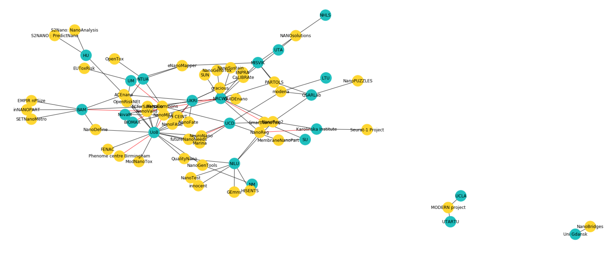

# EPIX_overview
Overview of EU funded Research &amp; Innovation projects in X (EPIX). Where X in this case is the field of nanosafety, nanoinformatics, computational toxicology, NMs characterization and RA

A first visualization of the network looks like this:

